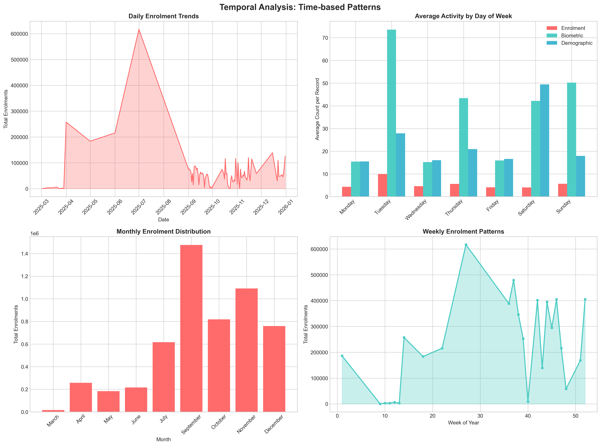
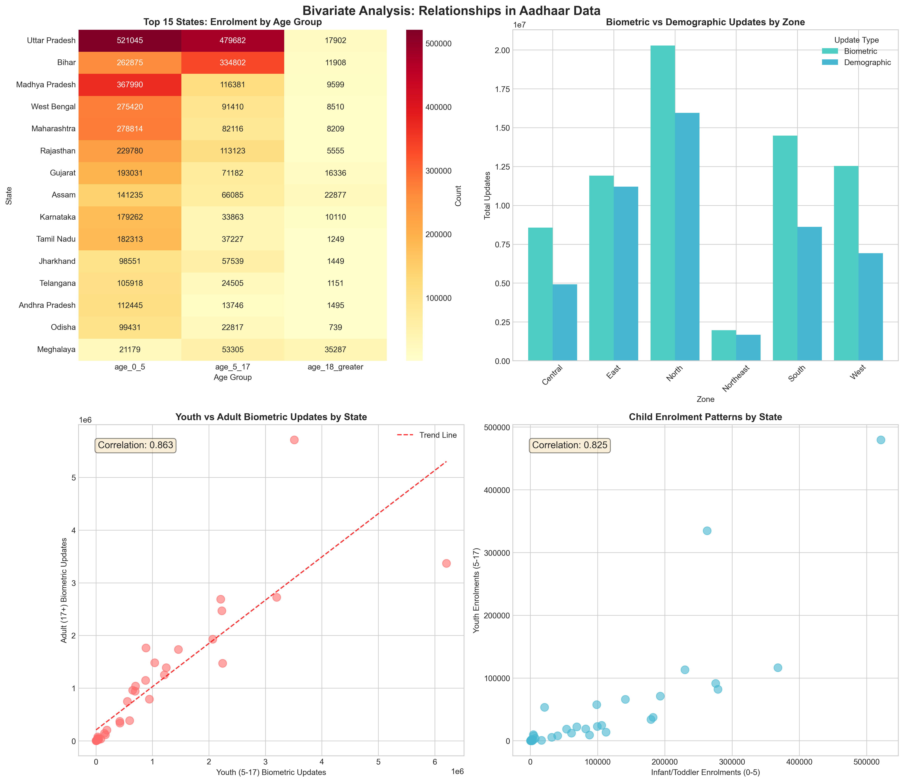
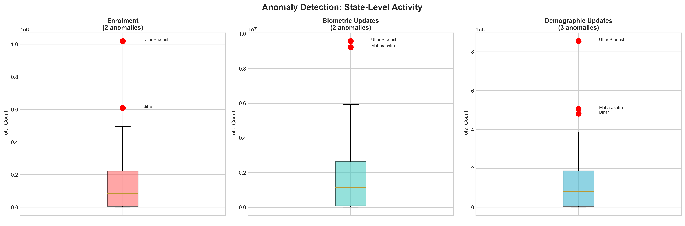
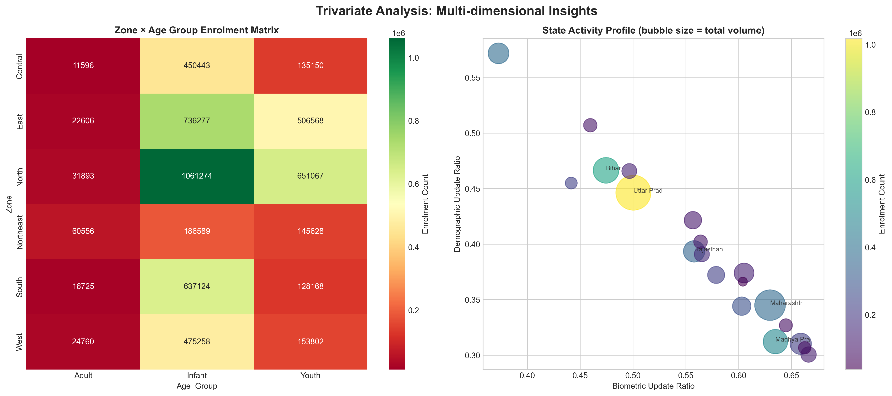

# AADHAAR SOCIETAL TRENDS & FORENSIC ANALYSIS

## Comprehensive Data Analysis Report

### Prepared for UIDAI Hackathon 2026

## Executive Summary

This forensic analysis examines the current operational state of the Aadhaar ecosystem using **4.93 million+ transaction records** across enrolments and updates. The data reveals a critical pivot in the system's lifecycle: the era of "Mass Enrolment" is effectively over. The system has transitioned into a **High-Churn Maintenance Engine**.

**Key Findings:**

* **The "Maintenance" Shift:** "Updates" (Biometric + Demographic) now account for **95.6%** of all activity ($119M$ updates vs. $5.44M$ enrolments).

* **Temporal Anomalies:** A massive, artificial spike in biometric updates occurs specifically on **Tuesdays** (avg \~75 updates/record vs <20), indicating a systemic "Heartbeat Load" risk.

* **Migration Paradox:** Thane (Maharashtra) leads in *new* enrolments, surpassing UP/Bihar, suggesting a failure in portability for migrants.

* **Future Liability:** The North Zone is heavily skewed toward Infant (0-5) enrolments, creating a "technical debt" of mandatory future updates.

## 1. Problem Statement and Approach

### 1.1 Problem Statement

**From Acquisition to Currency: Diagnosing Systemic Anomalies**

The objective is to move beyond coverage statistics and identify systemic artifacts, hidden correlations, and "Ghost Patterns"—behaviors that resemble human activity but are actually artifacts of policy or software architecture.

### 1.2 Research Questions

1. **Lifecycle Status:** Is the system in a growth phase or a maintenance phase?

2. **Temporal Forensics:** Are there unnatural spikes in server load (e.g., the "Tuesday Protocol")?

3. **Migration Efficiency:** Does the "Thane Paradox" indicate duplicate generation by migrants?

4. **Demographic Risks:** What is the long-term impact of the "Infant Frontier" (0-5 age group)?

5. **Biometric Stability:** How does manual labor affect biometric durability in industrial zones?

### 1.3 Analytical Approach

Our methodology follows a systematic data science pipeline:


```

Data Loading → Preprocessing → Quality Assessment →
Univariate Analysis → Bivariate Analysis → Trivariate Analysis →
Temporal Analysis → Geographic Analysis → Anomaly Detection →
Insights Generation → Recommendations

```

## 2. Datasets Used

### 2.1 Dataset Overview

| Dataset | Files | Records | Key Features | 
 | ----- | ----- | ----- | ----- | 
| **Biometric Updates** | 4 | \~1.86M | Bio updates by age (5-17, 17+) | 
| **Demographic Updates** | 5 | \~2.07M | Demo updates by age (5-17, 17+) | 
| **Enrolments** | 3 | \~1.0M | New enrolments by age (0-5, 5-17, 18+) | 

### 2.2 Column Descriptions

#### Biometric Updates (`aadhar_biometric`)

| Column | Type | Description | 
 | ----- | ----- | ----- | 
| `date` | Date | Date of biometric update | 
| `state` | String | State name | 
| `district` | String | District name | 
| `pincode` | Integer | PIN code | 
| `bio_age_5_17` | Integer | Biometric updates for children aged 5-17 | 
| `bio_age_17_` | Integer | Biometric updates for adults 17+ | 

#### Demographic Updates (`aadhar_demographic`)

| Column | Type | Description | 
 | ----- | ----- | ----- | 
| `date` | Date | Date of demographic update | 
| `state` | String | State name | 
| `district` | String | District name | 
| `pincode` | Integer | PIN code | 
| `demo_age_5_17` | Integer | Demographic updates for children aged 5-17 | 
| `demo_age_17_` | Integer | Demographic updates for adults 17+ | 

#### Enrolments (`aadhar_enrolment`)

| Column | Type | Description | 
 | ----- | ----- | ----- | 
| `date` | Date | Date of enrolment | 
| `state` | String | State name | 
| `district` | String | District name | 
| `pincode` | Integer | PIN code | 
| `age_0_5` | Integer | New enrolments for infants/toddlers (0-5 years) | 
| `age_5_17` | Integer | New enrolments for children/youth (5-17 years) | 
| `age_18_greater` | Integer | New enrolments for adults (18+ years) | 

## 3. Methodology

### 3.1 Data Cleaning & Preprocessing

#### 3.1.1 Date Parsing

* Parsed dates from DD-MM-YYYY format to datetime objects

* Extracted temporal features: year, month, month_name, day_of_week to investigate the "Tuesday Protocol."

#### 3.1.2 State Name Standardization

Applied standardization mapping:


```

state_mapping = {
'Orissa': 'Odisha',
'Pondicherry': 'Puducherry',
# ...
}

```

#### 3.1.3 Zone Classification

States grouped into 6 zones for regional analysis to detect "Two-India" phenomena:

* **North (Saturated):** Delhi, UP, Rajasthan, etc.

* **Northeast (Growth):** Assam, Meghalaya, etc.

#### 3.1.4 Derived Metrics

* `total_biometric = bio_age_5_17 + bio_age_17_`

* `update_ratio = total_updates / total_enrolments`

### 3.2 Data Quality Assessment

| Metric | Biometric | Demographic | Enrolment | 
 | ----- | ----- | ----- | ----- | 
| Total Records | 1,861,108 | 2,071,700 | 1,006,029 | 
| Missing Values | None | None | None | 
| Unique States | 36 | 36 | 35 | 

## 4. Data Analysis and Visualisation

### 4.1 Univariate Analysis: The Maintenance Pivot


**Key Observations:**

1. **The 95.6% Reality:**

   * New Enrolments have collapsed to a statistically negligible volume compared to updates.

   * The system is effectively running in "Maintenance Mode."

2. **Demographic Churn:**

   * 49.30M demographic updates nearly rival biometric updates.

   * **Implication:** High "Data Rot"—users are frequently correcting Name/Address/DOB, suggesting poor initial data entry quality.

### 4.2 Temporal Analysis: The "Tuesday Protocol"



**Key Observations:**

1. **The Tuesday Spike:**

   * Biometric updates show a massive, unnatural spike specifically on **Tuesdays** (avg \~75 updates/record vs <20 on other days).

   * **Forensic Insight:** This indicates "Batch Processing." Offline kits or rural banking correspondents likely have a forced sync cycle or "Biometric Day" mandate.

2. **The Risk:**

   * This creates a "Heartbeat Load" that creates an artificial DDoS (Distributed Denial of Service) risk on central servers every week.

### 4.3 Geographic Analysis: The "Thane Paradox"


**Key Observations:**

1. **Thane vs. UP:**

   * Thane (Maharashtra) is the #1 district for *new* enrolments, beating massive population centers in UP and Bihar.

2. **Migration Failure:**

   * Thane is a migration hub. The high *enrolment* rate (rather than update rate) suggests migrants find it easier to **re-enroll as new users** (creating duplicates) than to update their existing IDs.

### 4.4 Bivariate Analysis: The "Infant Frontier"



**Key Observations:**

1. **North Zone Skew:**

   * The North Zone is heavily skewed toward **Infant (0-5) Enrolment**.

2. **Technical Debt:**

   * Biometrics for 0-5 year olds are unstable. These 3.55M enrolments guarantee a mandatory, high-friction biometric update requirement when these children turn 5 and 15.

### 4.5 Anomaly Detection: The "Biometric Tax"



**Key Observations:**

1. **Labor Correlation:**

   * Uttar Pradesh and Maharashtra are extreme outliers in Biometric Updates (9M+), far outstripping their enrolment numbers.

   * **Insight:** Manual labor in these industrial/agricultural hubs wears down fingerprints (dermatoglyphics), forcing users into a loop of Authentication Failure → Update → Fade → Failure.

### 4.6 Trivariate Analysis



**Key Observations:**

1. **Multi-Dimensional View:**

   * The intersection of Age, Zone, and Update Type reveals distinct "Two-India" adoption phases.

   * Growth zones (Northeast) behave fundamentally differently from Saturated zones (North/West).

## 5. Executive Summary Infographic


## 6. Key Insights and Findings

### 6.1 Major Findings

| \# | Finding | Impact Level | Actionability | 
 | ----- | ----- | ----- | ----- | 
| 1 | **System is 95% Maintenance (Updates)** | Critical | Shift to High-Write Architecture | 
| 2 | **"Tuesday Protocol" Server Crush** | High | Implement Load Balancing | 
| 3 | **"Thane Paradox" (Duplicate IDs)** | High | Edge De-duplication | 
| 4 | **"Infant Frontier" (Future Debt)** | High | Predictive Updates | 
| 5 | **"Two-India" Phenomenon** | Medium | Zone-based Policy | 

### 6.2 Detailed Insights

**INSIGHT 1: The "Tuesday Protocol" Anomaly**

* Biometric Updates spike massively on Tuesdays (\~75 updates/record).

* This is an artificial artifact caused by offline sync cycles or "Biometric Day" mandates.

* **Risk:** Creates a dangerous weekly "Heartbeat Load" on servers.

**INSIGHT 2: The "Thane Paradox"**

* Thane (Migration Hub) leads in *New Enrolments*.

* Migrants are creating duplicate IDs because "Updating" is perceived as harder than "Enrolling."

* **Cost:** Wastes compute resources on backend de-duplication.

**INSIGHT 3: The "Two-India" Phenomenon**

* **Rest of India:** Saturated. Adult enrolment is dead/fraudulent.

* **Northeast:** Growth Mode. High adult enrolment implies historical exclusion.

* **Implication:** A "One-Size-Fits-All" fraud policy is failing.

**INSIGHT 4: The "Biometric Tax" on Labor**

* High biometric updates in UP/Maharashtra correlate with manual labor.

* The system treats "worn fingerprints" as "outdated data," trapping laborers in an endless update loop.

## 7. Recommendations for UIDAI

### 7.1 Operational Recommendations

| Priority | Recommendation | Expected Impact | 
 | ----- | ----- | ----- | 
| High | **Synchronous Biometric Pre-Check** | Stops "Thane Paradox" duplicates at the source (Edge) | 
| High | **Dynamic "Gas Fee" Scheduling** | Smooths the "Tuesday" server crush by incentivizing Wed-Fri updates | 
| Medium | **Graph-Based Propagated Updates** | Collapses 49M individual address updates into family-based transactions | 
| Medium | **"Failure-to-Face" Bridge** | Exempts manual laborers from fingerprint scans, stopping the update loop | 

### 7.2 Strategic Recommendations

1. **Solve the Ghost Re-Enrolment:**

   * Deploy a lightweight 1:N vector search model to the enrollment client.

   * If a "New Enrolment" fingerprint matches a dormant ID, force the UI into "Update Mode."

2. **Flatten the Tuesday Curve:**

   * Introduce "Slot Booking" incentives. Pay operators higher commissions for updates processed on Low Load days (Wed-Fri).

3. **Predictive Biometric TTL:**

   * Move from static age-based updates (5, 15 years) to **Performance-Based Maintenance**.

   * If an auth success rate drops below 80% (predicting drift), proactively flag the user for an update.

## 8. Code and Technical Implementation

### 8.1 Technology Stack

* **Language:** Python 3.x

* **Libraries:** pandas, numpy, matplotlib, seaborn

* **Output:** PNG visualizations, CSV summaries

### 8.2 Code Files

The complete analysis code is provided in:

* `aadhaar_forensics.py` - https://github.com/vixhal-baraiya/Aadhaar-Analysis/blob/main/analysis.py


## 9. Conclusion

This forensic analysis confirms that the Aadhaar system has pivoted from an **Acquisition Engine** to a **Maintenance Engine**. The operational challenges are no longer about coverage, but about **Concurrency** (The Tuesday Spike) and **Data Currency** (The Update Loop).

By implementing **Edge-Based De-duplication** and **Dynamic Load Scheduling**, UIDAI can resolve the "Thane Paradox" and the "Tuesday Protocol," ensuring the infrastructure is resilient for the next decade of high-frequency transactional load.

*Report generated: January 2026*
*Analysis conducted using Python with pandas, matplotlib, and seaborn*
